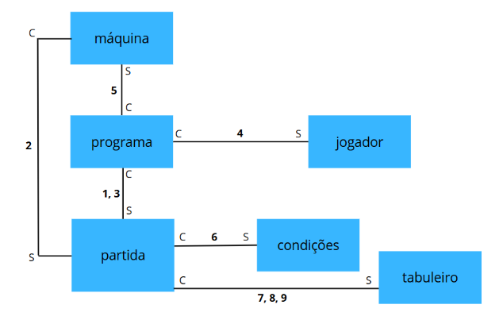

# Jogo da Velha — INF1040 2025.1

Projeto desenvolvido para a disciplina **Programação Modular (INF1040 - PUC-Rio)**.

---

## 📌 Descrição

Este projeto implementa um **jogo da velha em Python**, com foco na aplicação de conceitos de **programação modular**, como encapsulamento, baixo acoplamento e alta coesão.

A aplicação é executada via terminal e permite partidas entre jogadores humanos ou contra uma máquina com lógica simples.

---

## 🎯 Funcionalidades

- ✔ Inserção de jogadas com validação
- ✔ Alternância automática de turnos
- ✔ Modo jogador vs jogador
- ✔ Modo jogador vs máquina
- ✔ IA com estratégia:
  - Vencer se possível
  - Bloquear o adversário
  - Priorizar centro e cantos
- ✔ Verificação automática de:
  - Vitória (linhas, colunas e diagonais)
  - Empate (velha)
- ✔ Reinício de partidas

---

## 🧩 Arquitetura do Sistema

O projeto foi estruturado de forma modular, separando responsabilidades entre diferentes componentes.

Cada módulo possui funções bem definidas, facilitando manutenção, testes e reutilização.



### 🔗 Organização dos módulos

- **programa** → controla o fluxo principal do jogo  
- **partida** → gerencia as regras da partida  
- **tabuleiro** → encapsula o estado do jogo  
- **condições** → verifica vitória ou empate  
- **jogador** → coleta entrada do usuário  
- **máquina** → define jogadas automáticas  

As marcações **C (Chamador)** e **S (Servidor)** indicam as relações de dependência entre os módulos.

---

## 📁 Estrutura do Projeto
.
├── programa.py      # Controle principal do jogo (main)
├── partida.py       # Regras da partida e interface com tabuleiro
├── tabuleiro.py     # Estrutura de dados do jogo
├── condicoes.py     # Verificação de vitória/empate
├── jogador.py       # Entrada do usuário
├── maquina.py       # Lógica da IA
├── testes/
│   ├── teste_programa.py
│   ├── teste_partida.py
│   ├── teste_tabuleiro.py
│   ├── teste_condicoes.py
│   ├── teste_jogador.py
│   └── teste_maquina.py

---

## ⚙️ Como executar

### ▶️ Rodar o jogo

```bash
python3 programa.py
